# SharePoint File Downloader - Complete Activity Flow Diagram

## Main Execution Paths with Intersection Points


## **INTERSECTION POINT**: Both Paths Converge at Connect-SharePointSession

### Complete Shared Function Tree (Used by Both Setup and Download Modes)

```mermaid
graph TD
    A[🔄 Connect-SharePointSession<br/>URL parameter] --> B[Get-SharePointSessionInfo<br/>URL]
    B --> C[Resolve-SharePointVersion<br/>URL]
    C --> D{URL Pattern?}
    D -->|*.sharepoint.com| E[Return '365']
    D -->|Other| F[Return '2019']
    
    E --> G[Get script:ChromeDriver_SP365<br/>AuthPort=9222<br/>AuthUrl=SP365_DefaultLoginUrl]
    F --> H[Get script:ChromeDriver_SP2019<br/>AuthPort=9223<br/>AuthUrl=derived from URL]
    
    G --> I[Return SessionInfo<br/>Driver: $script:ChromeDriver_SP365<br/>SpVer: '365'<br/>AuthPort: 9222<br/>AuthUrl: SP365_DefaultLoginUrl<br/>]
    
    H --> J[Return SessionInfo<br/>Driver: $script:ChromeDriver_SP2019<br/>SpVer: '2019'<br/>AuthPort: 9223<br/>AuthUrl: derived URL<br/>]
    
    I --> K[Connect-AuthSession<br/>SessionInfo]
    J --> K
    
    K --> L{SessionInfo.Driver exists?}
    L -->|Yes| M[Test-SessionValidity<br/>Driver, CanaryUrl]
    L -->|No| N[Start-AuthSession<br/>SessionInfo]
    
    M --> O{Session Valid?}
    O -->|Yes| P[Return existing Driver<br/>✅ Reusing session]
    O -->|No| Q[Start-AuthSession<br/>SessionInfo<br/>🔄 Recreating session]
    
    N --> R[Test-ChromeDebugConnection<br/>AuthPort]
    Q --> R
    
    R --> S{Debug Port Available?}
    S -->|Yes| T[Start-SeChrome<br/>ChromeDebuggerAddress<br/>✅ Connected to existing Chrome]
    S -->|No| U[Start-SeChrome<br/>Normal Session<br/>🆕 New Chrome instance]
    
    T --> V[Store Driver in Script Variable]
    U --> W[Enter-SeUrl AuthUrl<br/>Prompt for login]
    W --> V
    
    V --> X{SpVer?}
    X -->|365| Y[script:ChromeDriver_SP365 = Driver]
    X -->|2019| Z[script:ChromeDriver_SP2019 = Driver]
    
    Y --> AA[Return Driver to caller]
    Z --> AA
    P --> AA
```



## Download Mode Continuation (After Session Management)


## Key Intersection Analysis

### **1. Shared Entry Point: Connect-SharePointSession**

**Setup Mode calls it twice:**
```powershell
# In Initialize-SharePointSessions
Connect-SharePointSession -Url $script:SP365_DefaultLoginUrl
Connect-SharePointSession -Url $script:SP2019_DefaultLoginUrl
```

**Download Mode calls it once:**
```powershell
# In Get-SharePointFile  
Connect-SharePointSession -Url $UserProvidedUrl
```

### **2. Shared Function Tree (Same for All Calls)**

Both modes execute identical logic:
- `Get-SharePointSessionInfo` → URL analysis
- `Resolve-SharePointVersion` → Determine SP365/SP2019
- `Connect-AuthSession` → Session validation/creation
- `Start-AuthSession` → New session creation when needed
- Script variable management → Same storage locations

### **3. Script Variable Intersection**

**Setup Mode populates variables:**
```powershell
# After Initialize-SharePointSessions completes
$script:ChromeDriver_SP365 = WebDriver   # From SP365 setup
$script:ChromeDriver_SP2019 = WebDriver  # From SP2019 setup
```

**Download Mode reuses those variables:**
```powershell
# In Get-SharePointSessionInfo, retrieves:
$existingDriver = $script:ChromeDriver_SP365   # If URL is SP365
$existingDriver = $script:ChromeDriver_SP2019  # If URL is SP2019
```

### **4. Session Lifecycle Shared Behavior**

**Both modes follow same session logic:**
1. **Check existing** → Use `$script:ChromeDriver_*` variables
2. **Validate session** → `Test-SessionValidity` on existing drivers  
3. **Reuse if valid** → Return existing driver without recreation
4. **Recreate if invalid** → Call `Start-AuthSession` with same logic
5. **Store for future** → Update `$script:ChromeDriver_*` variables

## Flow Summary by Mode

### **Setup Mode Flow**
```
mainEntryBlock(URL=null) 
→ Initialize-SharePointSessions 
→ Connect-SharePointSession (×2 calls)
→ [SHARED SESSION MANAGEMENT TREE]
→ Store both SP365 and SP2019 drivers
→ Return setup status
```

### **Download Mode Flow** 
```
mainEntryBlock(URL=provided) 
→ Get-SharePointFile
→ Connect-SharePointSession (×1 call)
→ [SAME SHARED SESSION MANAGEMENT TREE]
→ Reuse existing driver OR create new one
→ Request-SharePointFile + file operations
→ Optional session cleanup
```

## Benefits of This Shared Architecture

1. **Code Reuse**: Session management logic written once, used everywhere
2. **Consistent Behavior**: Same session validation/creation regardless of entry path  
3. **State Persistence**: Setup Mode creates sessions that Download Mode reuses
4. **Efficient Resource Usage**: Avoids duplicate Chrome instances
5. **Transparent Fallback**: Both modes handle missing/invalid sessions identically

The intersection at `Connect-SharePointSession` creates a unified session management system that serves both operational modes while maintaining the script's elegant simplicity.