# Get-SharePointFile Automation Tool

## What This Does

This tool provides a user-friendly way to download files from both **SharePoint 365** and **SharePoint 2019 (On-Premises)** by simply dragging and dropping a URL onto a helper script.

It is designed for environments where creating direct API connections is restricted. It works by automating a local Chrome browser, using persistent login sessions to avoid the need to re-authenticate for every download. The tool is built to be robust, handling its own dependencies, session validation, and file name conflicts automatically.

## SARA & Cybersecurity Approval

This tool has been approved for use on corporate assets. For detailed information, please refer to the official documentation:

* **SARA (Security and Risk Assessment):** 

    [17521 ChromeDriver](https://workflow.gd-ms.com/suite/sites/scmsara-site/page/records/record/lkBxRyU7YeUco_WDGJe6QLW_-MDV3s_zsP5sZvRyiDNM7jLZxXBqHrlf2yorCgG7v0p1x57xu2ZK3Qrd2b4j2_ghf7eedAOYpHoBbHoOkOVwUaUMLp9W11H2Q/view/summary)

    [17520 PowerShell Selenium Module](https://workflow.gd-ms.com/suite/sites/scmsara-site/page/records/record/lkBxRyU7YeUco_WDGJe6QLW_-MDV3s_zsP5sZvRyiDNM7jLZxXBqHrlf2yorCgG7v0p1x57xu2ZK3Qrd2b4j2_ghf7fedAIn2yBGCGfX1qYMQqlAfItrtjA4A/view/summary)


* **Cybersecurity Approval Record:** `[Link to Approval Record]`

    [13798  ChromeDriver 114+](https://workflow.gd-ms.com/suite/sites/cyber-security-software-assess/page/home/record/lkBxRyU7YeUco_WDGJe6AbV_7puuL-cUacR2sbfwPbAClIz2umNdAevGKfP9kF9r2lSi3gQOrH9qjwRtyhZCnivGGzVSuBOL0z7ukIibohzRmF1mVc6Be57dg/view/summary)

    [14285  PowerShell Selenium Module 3.*](https://workflow.gd-ms.com/suite/sites/cyber-security-software-assess/page/home/record/lkBxRyU7YeUco_WDGJe6AbV_7puuL-cUacR2sbfwPbAClIz2umNdAevGKfP9kF9r2lSi3gQOrH9qjwRtyhZCnioHe12KOYAKB66K9Kog2Cs1N0E3q4OZYQpIQ/view/summary)


## Installation and Setup

Follow these steps for a one-time setup.

### Step 1: Get the Required Components

1.  **Selenium Module (Automated):** The main script will automatically install the required `Selenium` PowerShell module for you the first time it runs. You do not need to do anything for this step.

2.  **ChromeDriver (Manual):**
    * This package should already include a `chromedriver.exe` file. This file is required for the script to control the Chrome browser.
    * If you ever need to get a different version, download the `chromedriver-win64.zip` file from the [Chrome for Testing Dashboard](https://googlechromelabs.github.io/chrome-for-testing/) that matches your browser version.
    * Place the `chromedriver.exe` from the zip file into this same folder.

### Step 2: Run the Setup Script

Right-click on `1-RunFirst-Setup.ps1` and select **"Run with PowerShell"**.

* A PowerShell window will open. It will check for dependencies (and install Selenium if needed).
* Two separate Chrome browser windows will launch.
* In one window, **log in to SharePoint 365**.
* In the other window, **log in to SharePoint 2019**.
* Once you are logged in to both, you can close the PowerShell window. These browser windows can be minimized but should be left running for the script to work. If this process completes successfully, your setup is complete.

---

## How to Use the Helper Scripts

**Note:** If your company's email system renames the helper scripts to `.bat.txt`, you must first rename them back to `.bat` for them to work.

### `1-RunFirst-Setup.ps1`

* **Purpose:** Initializes your environment. It checks for dependencies, installs them if needed, and launches the two persistent Chrome sessions for you to log into.
* **When to use:** Run this once after unzipping the package, or anytime you restart your computer. Right-click and select **"Run with PowerShell"**.

### `2-Download-File.bat`

* **Purpose:** Downloads a file to your default `Downloads` folder.
* **How to use:** Drag a URL from your browser's address bar and drop it directly onto this script icon.

### `3-Download-And-Open-File.bat`

* **Purpose:** Downloads a file and immediately opens it with its default application.
* **How to use:** Drag a URL from your browser's address bar and drop it directly onto this script icon.

### `4-Update-ChromeDriver.ps1`

* **Purpose:** Fixes errors that occur after your Chrome browser auto-updates.
* **When to use:** Run this script if you see a "session not created" error. It copies the new `chromedriver.exe` from this folder into the Selenium module's directory. Right-click and select **"Run with PowerShell"**.

### Pinning to the Taskbar (Optional)

For even easier access, you can pin the download helper scripts to your Windows Taskbar. This requires a few extra steps to work with Windows 11.

1.  In the folder, right-click on `2-Download-File.bat` and select **Show more options** > **Create shortcut**.
2.  Right-click the new shortcut and choose **Properties**.
3.  In the **Target** field, add `cmd.exe /c ` at the very beginning, before the existing path. The path should be enclosed in quotes. It should look like this:
    ```
    cmd.exe /c "C:\Path\To\Your\Folder\2-Download-File.bat"
    ```
4.  (Optional) Click **Change Icon...** to select a more descriptive icon.
5.  Click **OK**.
6.  You can now **drag this modified shortcut** to your taskbar to pin it successfully.
7.  Repeat this process for `3-Download-And-Open-File.bat` to have both options available.

Now you can drag and drop URLs directly onto these icons on your taskbar.

---

## How to Update the Package

When your Chrome browser updates, the script may stop working. To fix this:

1.  The package maintainer will provide an updated package with a new `chromedriver.exe`.
2.  Replace your old package folder with the new one.
3.  Run the `4-Update-ChromeDriver.ps1` script once. This will copy the new driver into place, and the tool will work again.

---

## How This Works

### Execution Modes

The tool has three primary execution modes:

1.  **Download Mode (URL is provided):** When you drag a URL onto a helper script, it calls the main `Get-SharePointFile.ps1` script and passes the URL as a parameter. This initiates the download workflow.
2.  **Setup Mode (No URL is provided):** When you run `1-RunFirst-Setup.ps1`, it executes the main script without a URL. The script detects this and enters Setup Mode, launching the persistent browser sessions for you to log into.
3.  **Library Mode (Dot-Sourced):** For advanced users, dot-sourcing the script (`. .\Get-SharePointFile.ps1`) in a PowerShell console loads all its functions for interactive use without executing any logic.

### The Download Workflow (`Get-SharePointFile` function)

When a download is initiated, the script follows a structured process:

1.  **Resolve Version:** The script first calls `Resolve-SharePointVersion` to analyze the URL. This determines if the target is SharePoint 365 or 2019 and returns the correct authentication port (e.g., 9222) and login URL.
2.  **Connect to Session:** It then calls `Connect-SharePointSession`. This powerful function:
    * Checks if the required Chrome session is already running.
    * If not, it starts a new, temporary session and waits for you to log in.
    * It immediately calls `Test-SessionValidity` to ensure the login is active. If the session has expired (e.g., you are redirected to a login page), it will pause and prompt you to re-authenticate in the browser window before proceeding.
    * It returns the browser `driver` object and an indicator if the session is new.
3.  **Request File:** With a valid session, it calls `Request-SharePointFile`. This function:
    * Starts a timer.
    * Navigates to the file URL, which triggers the browser's native download.
    * Monitors the `Downloads` folder until the file is fully downloaded (the `.crdownload` file is gone).
    * Stops the timer and returns the path to the downloaded file and the total duration.
4.  **Finalize and Clean Up:**
    * If you provided a destination directory (`-DestDir`), the script moves the file from your `Downloads` folder to the specified location.
    * If you used the `-DoNotPersist` switch *and* a new session was created for the download, the script automatically closes the temporary browser window.

# SharePoint File Downloader - Public/Private API Activity Flow

## Activity Data Flows
> The following **[Mermaid](https://mermaid.js.org/intro/syntax-reference.html)** extension to the **[Markdown Language](https://www.markdownguide.org/basic-syntax/)** requires that the *md render have explicit support for Mermaid drawings.


## Main Execution Paths with Public/Private Separation

```mermaid
graph TD
    A[Script Entry Point] --> B{Sourced?}
    B -->|No| C[Direct Execution Block]
    B -->|Yes| D[📚 PUBLIC API Available]
    
    C --> E{URL Provided?}
    E -->|No| F[Setup Mode: Direct Calls]
    E -->|Yes| G[Download Mode: Direct Call]
    
    F --> H[initializeAuthenticationSessions<br/>SP365_DefaultLoginUrl]
    F --> I[initializeAuthenticationSessions<br/>SP2019_DefaultLoginUrl]
    G --> J[Get-SharePointFile<br/>User URL + Parameters]
    D --> J
    D --> H
    
    H --> K[🔄 SHARED PRIVATE IMPLEMENTATION]
    I --> K
    J --> L[_Connect-SharePointSession<br/>User-provided URL]
    L --> K
    
    K --> M[Private Function Pipeline<br/>See detailed flow below]
```



## **SHARED PRIVATE IMPLEMENTATION**: Session Management Pipeline


## Download Mode Private Function Pipeline (After Session Management)

```mermaid
graph TD
    A[Get-SharePointFile receives Driver<br/>from _Connect-SharePointSession] --> B[_Request-SharePointFile<br/>Driver, URL]
    
    B --> C[_Get-FileNameFromUrl<br/>URL]
    C --> D[_Remove-ExistingDownloadFiles<br/>Clear conflicts]
    D --> E[Enter-SeUrl<br/>URL, Driver<br/>🌐 Navigate to file]
    
    E --> F[_Wait-ForDownloadCompletion<br/>Monitor download progress]
    F --> G{Download Complete?}
    
    G -->|Yes| H[Get file size<br/>Return DownloadResult<br/>Success=true]
    G -->|No| I[Return DownloadResult<br/>Success=false, Error='Timeout']
    
    H --> J{DestDir specified?}
    I --> K[Get-SharePointFile handles error]
    
    J -->|Yes| L[_Move-DownloadedFile<br/>SourcePath, DestinationPath]
    J -->|No| M[Keep in default location]
    
    L --> N[_Get-UniqueFilePath<br/>Resolve conflicts]
    N --> O[Move-Item<br/>Physical file move]
    O --> P{Move Success?}
    
    P -->|Yes| Q[Return MoveResult<br/>Success=true, FilePath]
    P -->|No| R[Return MoveResult<br/>Success=false, Error]
    
    M --> S{Open requested?}
    Q --> S
    R --> S
    
    S -->|Yes| T[_Open-DownloadedFile<br/>Invoke-Item FilePath]
    S -->|No| U[Final result ready]
    
    T --> U
    U --> V{DoNotPersist?}
    
    V -->|Yes| W[Stop-SeDriver<br/>Close temporary session<br/>🗑️ Clean up]
    V -->|No| X[Keep session for reuse<br/>💾 Persist for future]
    
    W --> Y[Return final result to Execution Block]
    X --> Y
```



## Public API Usage Patterns

### **📚 Public Functions (User-Facing)**

```powershell
# Setup authentication for specific environment
$result = Initialize-AuthenticationSessions -Url "https://tenant.sharepoint.com"

# Download file with full options
$result = Get-SharePointFile -Url $fileUrl -DestDir "C:\Downloads" -Open -DoNotPersist
```

### **🔒 Private Functions (Implementation Details)**
```powershell
# Users should never call these directly:
# _Connect-SharePointSession, _StartAuthSession, etc.
# These are internal implementation details
```

## Script Variable Management (Critical for Persistence)

### **📍 Where Variables Get Set**: `_StartAuthSession`

```powershell
# 🔗 CRITICAL ASSIGNMENT POINTS in _StartAuthSession:
if ($SessionInfo.SpVer -eq $script:SP_VERSION_365) {
    $script:ChromeDriver_SP365 = $driver  # 📍 SP365 STORED HERE
} else {
    $script:ChromeDriver_SP2019 = $driver # 📍 SP2019 STORED HERE
}
```

### **📖 Where Variables Get Retrieved**: `_GetSharePointSessionInfo`

```powershell
# 🔗 RETRIEVAL POINTS in _GetSharePointSessionInfo:
if ($spVer -eq $script:SP_VERSION_365) {
    $existingDriver = $script:ChromeDriver_SP365    # 📖 SP365 RETRIEVED HERE
} else {
    $existingDriver = $script:ChromeDriver_SP2019   # 📖 SP2019 RETRIEVED HERE
}
```

## API Design Benefits

### **1. Clear Public Contract**
- Only 2 functions users need to know: `Get-SharePointFile` and `Initialize-AuthenticationSessions`
- Simple, focused API surface
- Implementation details hidden behind `_` prefix

### **2. Consistent Behavior Across Entry Points**

**Setup Mode Flow:**
```
Initialize-AuthenticationSessions → _ConnectSharePointSession → [Private Pipeline]
```

**Download Mode Flow:**
```
Get-SharePointFile → _ConnectSharePointSession → [Same Private Pipeline]
```

**Sourced Mode Flow:**
```
User calls Get-SharePointFile → [Same Private Pipeline]
```

### **3. Script Variable Persistence (Key Architecture)**

**Setup Mode populates variables:**
```powershell
# After initializeAuthenticationSessions calls:
$script:ChromeDriver_SP365 = WebDriver   # Stored in _Start-AuthSession
$script:ChromeDriver_SP2019 = WebDriver  # Stored in _Start-AuthSession
```

**Download Mode reuses those variables:**
```powershell
# In _GetSharePointSessionInfo:
$existingDriver = $script:ChromeDriver_SP365    # Retrieved for reuse
$existingDriver = $script:ChromeDriver_SP2019   # Retrieved for reuse
```

### **4. Constants Replace Magic Strings**

All version checks now use:
- `$script:SP_VERSION_365` instead of `"365"`
- `$script:SP_VERSION_2019` instead of `"2019"`

## Architecture Summary

1. **Public API**: Clean, focused functions for end users
2. **Private Implementation**: All complexity hidden behind `_` prefix  
3. **Shared Pipeline**: All paths converge at `_Connect-SharePointSession`
4. **Script Variable Management**: Clear assignment/retrieval points for session persistence
5. **Constants**: Eliminates hard-coded strings throughout the codebase

The intersection at `_ConnectSharePointSession` remains the elegant core, now with a much cleaner public/private separation.
